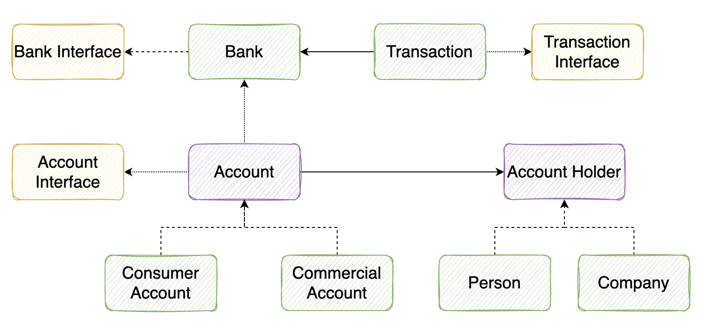

# Class Diagram

# Objectives
- Complete FurnitureOrder.java to make all test cases passed

# Commands
- mvn clean
  - Clear target folder
- mvn clean compile
  - Compile Main Code, and generate target folder
- mvn clean test
  - Run all test cases
- mvn clean test -Dtest=SampleTest
  - Run all test cases in a specific test java file (SampleTest.java)
- mvn clean install
  - Clean, compile, test and install into local repository
